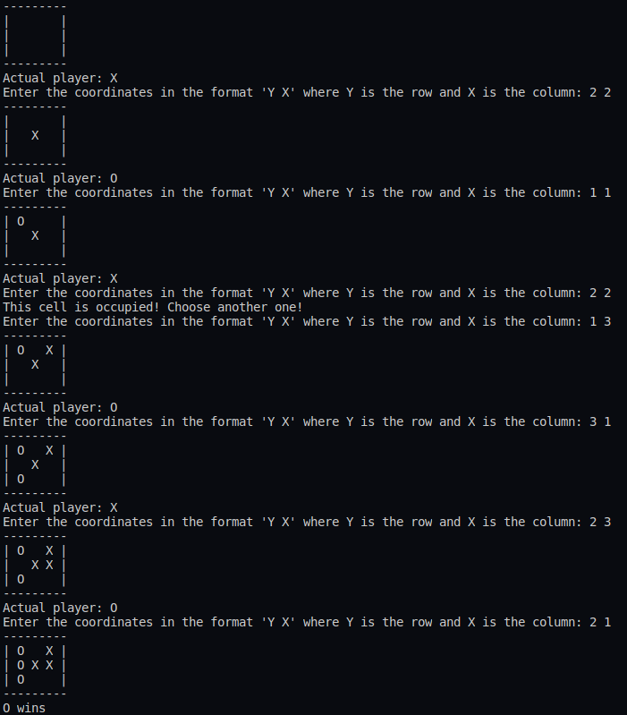

# Tic-Tac-Toe

## Description
The Tic-Tac-Toe is a terminal two players game.  
Each turn, a player enter the coordinates "Y X" of a position in the grid. Y corresponds to the row, from 1 to 3. X corresponds to the column, from 1 to 3.

### Preview

## More about this project

### Related course
JET BRAINS ACADEMY | PYTHON DEVELOPER

### Description of the project by JET BRAINS ACADEMY

#### About
Everybody remembers this paper-and-pencil game from childhood: Tic-Tac-Toe, also known as Noughts and crosses or Xs and Os. A single mistake usually costs you the game, but thankfully it is simple enough that most players discover the best strategy quickly. Let’s program Tic-Tac-Toe and get playing!

#### Learning outcomes
After finishing this project, you'll get to know a lot about planning and developing a complex program from scratch, using functions, handling errors, and processing user input.

### Technologies | Libraries | Frameworks | Tools  
- Python 3

### Details | Comments
- This project has been made from scratch following specific instructions. 

### Status
Completed

#### Last update
18/05/2020

#### Last update (README.md)
03/06/2020
